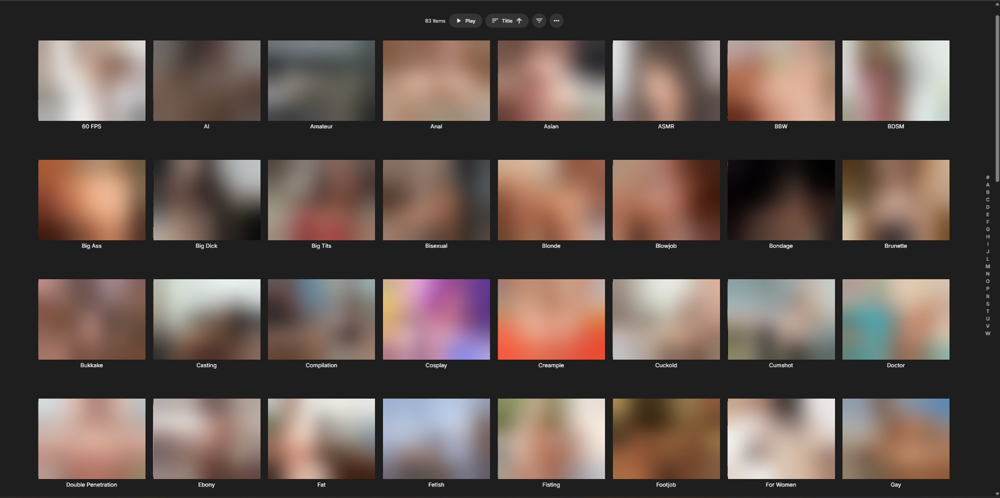

# Emby Eporner Channel Plugin

**Unofficial: this plugin is not affiliated with or endorsed by ePorner.**



Emby channel that lists ePorner videos by category (or custom search term) and plays them. It uses the official **API v2** for the video lists and reads the ePorner website for the category list and the stream links.
The channel carries the `XXX` parental rating.
Built against `MediaBrowser.Server.Core 4.10.0.24-beta2` (netstandard2.0) and tested on Emby Server 4.11.0.3.

## Structure

```
Eporner.csproj
Plugin.cs                      plugin, dashboard page registration, plugin logo
Configuration/
  PluginConfiguration.cs       settings (incl. per-category choices)
  configPage.html              dashboard page (embedded resource)
  epornerConfig.js             dashboard page controller
Api/
  HttpGate.cs                  all HTTP: serialised, rate-limited, one retry
  EpornerApiClient.cs          /video/search, /video/id, /video/removed + cache
  EpornerService.cs            GET /Eporner/Categories (used by the dashboard page)
Scraping/
  CategoryScraper.cs           category list (name, slug, image) from eporner.com/cats/
  StreamScraper.cs             real MP4/HLS URL extraction
Channels/
  EpornerChannel.cs            IChannel, IHasChannelFeatures, IRequiresMediaInfoCallback, ISupportsMediaProbe
Models/ApiModels.cs            API + player JSON DTOs
Services/
  EpornerHub.cs                shared HTTP gate, API client and scrapers
  TtlCache.cs                  in-memory TTL cache
Resources/logo.png             plugin and channel image
```

## Install

### Option 1: download the DLL (no build needed)

1. Download `Emby.Plugins.Eporner.dll` from the [Releases](../../releases) page.
2. Copy it into the `plugins` folder inside your Emby server's data folder (`<Emby data folder>\plugins`; the data path is shown on the Emby dashboard).
3. Restart Emby Server.

The release is built against Emby Server 4.10 and only tested on 4.11.0.3.

### Option 2: build it yourself

```
dotnet build -c Release -p:EmbyPluginsDir="<Emby data folder>\plugins"
```

The post-build step copies `Emby.Plugins.Eporner.dll` there (skipped if the property is unset). Restart Emby afterwards.
To build for another Emby version: `-p:EmbyVersion=<nuget version>` (the channel API differs between Emby versions, older releases may not compile).

### First steps

Open **Dashboard → Advanced → Eporner** and tick the categories you want (none are selected on a fresh install, so the channel stays empty until you do), save, and run the scheduled task
*Refresh Internet Channels*. The channel then shows up as *Eporner* in the library menu. If the settings page looks stale after an update, hard-refresh the browser (Ctrl+F5).

## Settings

| Setting | Meaning |
|---|---|
| Categories | pick which of the ~84 eporner.com categories are shown (none are selected on a fresh install) and how many videos each loads (default + per-category override) |
| Show each video in only one category | the first category that loads a video keeps it, so Emby's "Latest" row has no repeats |
| Video sort order | order of the videos in every category (latest, most popular, top rated ...) |
| Thumbnail size | `small` / `medium` / `big` |
| Trans content | exclude (default) / include / only; best-effort keyword filter in the plugin (the API has no such parameter); the *Shemale* category is hidden when excluded |
| Gay content | API `gay` parameter: exclude (default), include, only |
| Low quality videos | API `lq` parameter: exclude, include, only. "Low quality" is ePorner's own rating, not a resolution limit. With *Exclude*, rare search terms can lose most of their results; *Include* matches the website's search |
| Maximum video quality | cap the offered quality (Best available, 2160p ... 240p); lower values save bandwidth since Emby proxies every stream |
| Custom queries | comma-separated search terms, shown as folders next to the categories (in the Categories section; they use the default video count) |
| Cache lifetime, request interval | API cache and rate limiting |
| Hide removed videos | filter with `/video/removed/` |
| Embed fallback | expose embed URL when scraping fails (Emby can't play HTML, off by default) |

## How it works

* **Folders:** the channel root lists the categories (scraped from eporner.com/cats/) plus your custom queries. Each folder maps to `video/search/` with the category slug as query; Emby requests a folder once without paging (observed on 4.11), so the plugin loads "videos per category" items in one go (max 1000 per API request).
* **Items** carry no stream URL. `GetChannelItemMediaInfo` runs when playback starts and fetches fresh links. The CDN links are valid for about two hours and bound to the server's IP.
* **Stream extraction** (`StreamScraper`):
  1. Fetch `https://www.eporner.com/video-{id}/` (redirects to the slug URL; falls back to the API's `url`, then the embed page).
  2. Read `EP.video.player.hash` (32 hex chars), re-encode it (four 8-hex chunks → base36, concatenated), call
     `/xhr/video/{id}?hash=…&supportedFormats=dash,mp4`. The JSON lists every quality (240p–1080p/4K where available).
  3. If that fails, parse `<source>` tags / raw `.mp4` URLs from the HTML.
  4. Streams are sorted MP4-first, highest resolution first; each quality becomes a selectable media source.
     Requests are sent with `Referer: https://www.eporner.com/`. *Maximum video quality* removes qualities above the limit.
  5. Emby probes the stream itself (`ISupportsMediaProbe`), so it knows codec and bitrate and direct-streams instead of transcoding.
* Resolved streams are cached 5 minutes; API responses for the configured cache lifetime.

## Known limitations / weak spots

* **Categories:** the folder list (name + image) is scraped from https://www.eporner.com/cats/ and cached 24 h; the category slug is used as API query. If that page changes and cannot be read, the category list stays empty.
* **Videos per folder:** each folder loads up to the configured number of videos. If *Show each video in only one category* hides videos, more API pages are fetched (at most 20 requests per folder). A full refresh of many categories can take many minutes.
* **Sorting/paging:** Emby caches each folder as one full list and sorts it itself (default alphabetical); pick *Date added*/*Rating* in the client sort menu. Reload with the scheduled task *Refresh Internet Channels*.
* **Broken titles:** the ePorner API double-encodes non-ASCII text; the plugin repairs this, but titles whose bytes are already damaged in the API stay garbled.
* **No direct search box:** current Emby versions ignore `ISearchableChannel`. Use *Custom queries* for saved searches.
* **Scraping is unofficial.** It depends on the `EP.video.player.hash` variable, the hash encoding and the `/xhr/video/` JSON shape.
  If ePorner changes these, playback breaks (log line: `no stream found`). Fix points are in `StreamScraper` only.
* Stream URLs are bound to the IP that requested them, so Emby always proxies the stream (direct play is disabled).
* DASH sources are ignored. HLS sources are passed on if ePorner offers them (untested).
* `/video/removed/` redirects to a plain-text list of ids (one per line); the client parses that and caches it for at least an hour.
* Only tested on Emby Server 4.11.0.3.
* Respect ePorner's API terms and rate limits (default: ≥500 ms between requests).

## License

[MIT](LICENSE). This project is not affiliated with ePorner or Emby; all trademarks belong to their owners.
